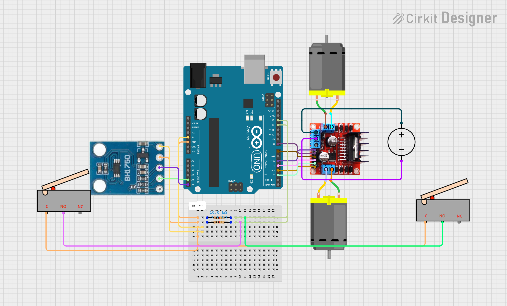

# Cleanova 
**Automatic Solar Panel Cleaning System – Arduino**

Cleanova is a low-cost embedded system designed to automatically detect dust accumulation on solar panels and trigger a motorised cleaning mechanism to maintain optimal energy efficiency.

---

## How It Works

A **BH1750** light sensor monitors the lux level falling on the panel surface.  
When the reading drops below a configurable dust threshold (during daylight hours), two DC motors drive the cleaning arm forward across the panel, then reverse it home once a limit switch is triggered.
ch is triggered.

```
┌─────────────┐    I²C     ┌─────────────┐
│  BH1750     │──────────► │             │
│ Light Sensor│            │   Arduino   │──► L298N ──► Motors
└─────────────┘            │             │
                           │             │◄── Limit Switch 1
┌─────────────┐            │             │◄── Limit Switch 2
│   Serial    │◄───────────│             │
│  Monitor    │            └─────────────┘
└─────────────┘
```

---

## Components

| Component | Description |
|-----------|-------------|
| Arduino Uno / Nano / Mega | Microcontroller |
| BH1750 | Ambient light sensor (I²C) |
| L298N | Dual H-bridge motor driver |
| 2× DC motors | Drive the cleaning arm |
| 2× Limit switches | Front (far end) and back (home) position detection |
| 12 V power supply | Motors; regulate 5 V for Arduino |

---
---

## 📸 Circuit Diagram



*A visual representation of the system connections between the Arduino, BH1750 sensor, motor driver, limit switches, and DC motors.*

---
## Wiring

### BH1750 → Arduino
| BH1750 | Arduino |
|--------|---------|
| VCC | 3.3 V or 5 V |
| GND | GND |
| SDA | A4 (Uno) |
| SCL | A5 (Uno) |

### L298N → Arduino
| L298N | Arduino Pin |
|-------|-------------|
| ENA (PWM) | 5 |
| ENB (PWM) | 3 |
| IN1 | 8 |
| IN2 | 7 |
| IN3 | 4 |
| IN4 | 2 |

### Limit Switches
Connect one terminal of each switch to the Arduino pin; the other terminal to **GND**.
The system uses `INPUT_PULLUP` internally (active LOW configuration), so no external resistor is required.  
Alternatively, external pull-up resistors can be used if preferred in hardware design.

| Switch | Arduino Pin |
|--------|-------------|
| Front (far end) | 12 |
| Back (home position) | 13 |

---

## Calibration

Open `cleanova_main.ino` and adjust the constants at the top of the file:

```cpp
// Lux reading below which the system assumes it is night
const float LUX_NIGHT_THRESHOLD = 100.0;

// Lux reading below which the panel is considered dusty
// Steps to measure:
//   1. Clean the panel thoroughly.
//   2. At noon on a clear day, note the lux reading (e.g. 2000 lx).
//   3. Multiply by 0.6–0.7 to get your dust threshold (e.g. 1200–1400 lx).
const float LUX_DUST_THRESHOLD = 600.0;

// Motor PWM speed (0–255)
const uint8_t MOTOR_SPEED = 150;

// Sensor polling interval in milliseconds (60 000 = 1 minute)
const unsigned long POLL_INTERVAL_MS = 60000;
```

> **Tip:** During development, set `POLL_INTERVAL_MS = 5000` so you see readings every 5 seconds. Switch back to 60 000 for deployment.

---

## Libraries

Install via **Arduino IDE → Tools → Manage Libraries**:

| Library | Version tested |
|---------|---------------|
| [BH1750 by Christopher Laws](https://github.com/claws/BH1750) | ≥ 1.3.0 |
| Wire (built-in) | — |

---

## Serial Monitor Output

At 9600 baud you will see:

```
[INFO] CleaNova system ready.
[SENSOR] Light: 1850.00 lx
[STATUS] Panel clean – no action needed.
[SENSOR] Light: 542.00 lx
[STATUS] Dust detected – starting cleaning pass.
[LIMIT]  Front switch triggered – reversing.
[LIMIT]  Back switch triggered – cleaning done.
```

---

## Repository Structure

```
Cleanova/ 
├── cleanova_main.ino      # Main Arduino sketch  
├── circuit_diagram.png    # Circuit diagram showing all hardware connections
└── README.md              # Project documentation and explanation
```

---
 

## License

MIT – free to use, modify, and distribute.
